# opentx-lua-rssi-histogram

This project is a LUA telemetry script for OpenTX that provides customized
telemetry screens, including a RSSI Histogram.

It's been tested and used on a QX7 and X9D with Open TX 2.2 for hundreds of
flights.  I have been finding it very useful and would like to freely share it.

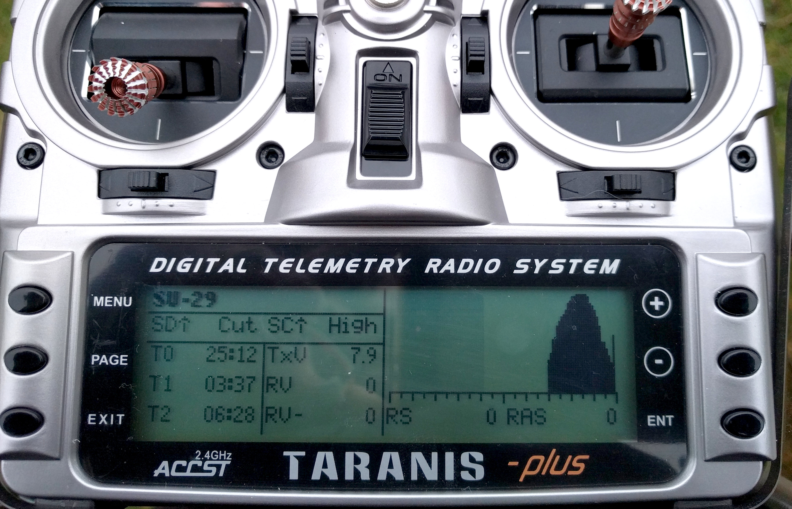

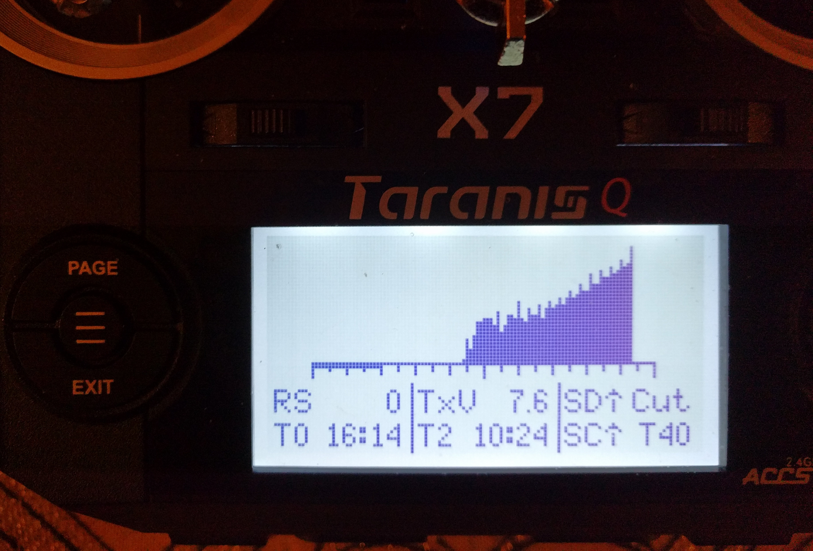

<!--ts-->
Table of Contents
=================

   * [opentx-lua-rssi-histogram](#opentx-lua-rssi-histogram)
      * [What is an RSSI Histogram?](#what-is-an-rssi-histogram)
      * [Why is a RSSI Histogram Useful?](#why-is-a-rssi-histogram-useful)
      * [How To Install](#how-to-install)
      * [Customization](#customization)
         * [Configuration File](#configuration-file)
         * [Widget Layout (Placement)](#widget-layout-placement)
      * [Widget Basics](#widget-basics)
      * [Widget Reference](#widget-reference)
         * [Current Date Widget](#current-date-widget)
            * [Usage Example:](#usage-example)
            * [Options:](#options)
         * [Current Time Widget](#current-time-widget)
            * [Usage Example:](#usage-example-1)
            * [Options:](#options-1)
         * [Label Widget](#label-widget)
            * [Usage Example:](#usage-example-2)
            * [Options:](#options-2)
         * [Line Widget](#line-widget)
            * [Usage Example:](#usage-example-3)
            * [Options:](#options-3)
         * [RSSI Histogram Widget](#rssi-histogram-widget)
            * [Usage Example:](#usage-example-4)
            * [Options:](#options-4)
         * [Switch Widget](#switch-widget)
            * [Usage Example:](#usage-example-5)
            * [Parameters](#parameters)
            * [Options:](#options-5)
         * [Timer Widget](#timer-widget)
            * [Usage Example:](#usage-example-6)
            * [Parameters](#parameters-1)
            * [Options:](#options-6)
         * [Value Widget](#value-widget)
            * [Usage Example:](#usage-example-7)
            * [Parameters](#parameters-2)
            * [Options:](#options-7)
         * [Per Radio and Per Model Customization](#per-radio-and-per-model-customization)
            * [Static Config](#static-config)
            * [Dynamic Config - Per model widgets](#dynamic-config---per-model-widgets)
            * [Dynamic Config - Per radio (or model) layouts](#dynamic-config---per-radio-or-model-layouts)
         * [Resetting](#resetting)
<!--te-->

## What is an RSSI Histogram?

A way of viewing RSSI data that clearly shows signal range and trends.

Many of us have viewed time-based RSSI plots in Companion software, where the
X axis is time and the Y axis is RSSI strength.  These are very useful for time
correlation of RSSI with other events.

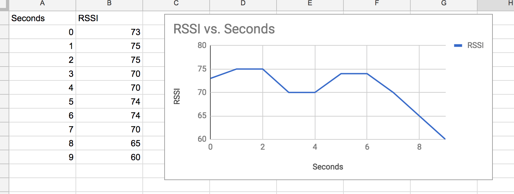

A histogram is a different "view" of the same data.  It puts the RSSI strength
in the X axis and the amount of time it was at that value in the Y axis.

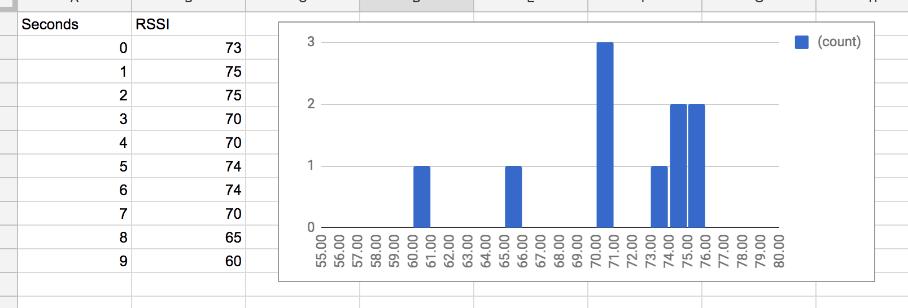

This makes it fast and easy to know how RSSI ranged over a flight and see if
there were any outlier events.  You lose time correlation but gain the ability
to see trends better.  Both have their place and are useful in different
situations.

## Why is a RSSI Histogram Useful?

Peace of mind and easy field experiments.

With a typical Taranis setup, you can set an alarm at an RSSI of 45 or so and
you'll know when RSSI is "bad".  But if one of your planes is flying at 300m
with an RSSI in the 70s and a different plane in the 50s, you'll have no
indication that the second plane is marginal.  The histogram makes it very easy
to see the problem in the field by glancing at the graph between flights.

As far as experiments, here are a few examples:

* Does it matter if I put my radio antenna sideways verses straight up?
* I'm going to try moving my receiver antennas, is it helping?
* Do I get a better signal if I fly on the other end of the field?
* I suspect that flying with dew on the grass is affecting my signal.  Is it
  true?

Just about anything you might want to try, you can quickly get feedback in the
field, then do followup as needed via Companion software at home.

The intent of the graph is not to replace your need of logging data but to
tighten the feedback loop for field experiments, make them more convenient, and
make potential problems more discoverable in their early stages.

## How To Install

The following instructions will work either on a real radio or simulated in
Companion software:

Copy the script `SCRIPTS/TELEMETRY/widget.lua` to `SCRIPTS/TELEMETRY/` on your
SD card

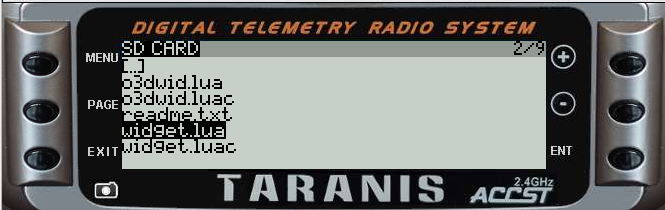

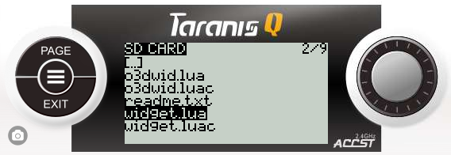

Choose a model to configure and go to the "Telemetry Screens" page Select
"widget.lua" for one of the telemetry pages

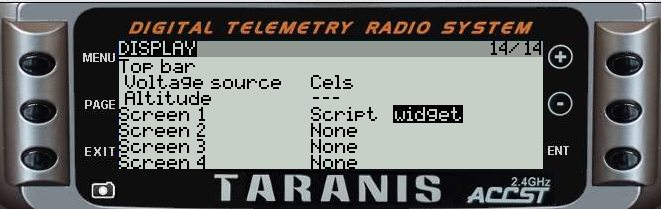

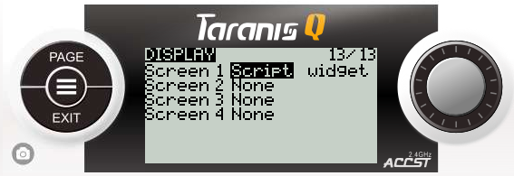

Hold the "Page" button to see telemetry screens, then press the "Page" button
to switch between screens.

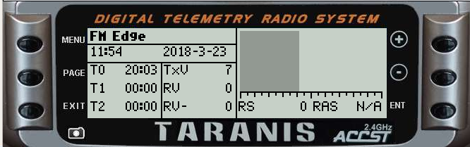

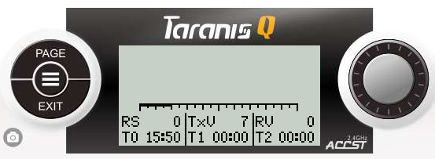

If you are simulating the setup in Companion, you can turn on fake telemetry in
the simulator to see fake data being plotted.

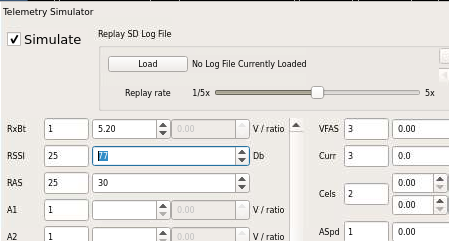

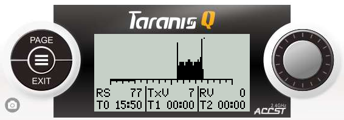

## Customization

You can customize the layout and content of the telemetry screen.

For example, here is an example that does away with the RSSI graph completely:

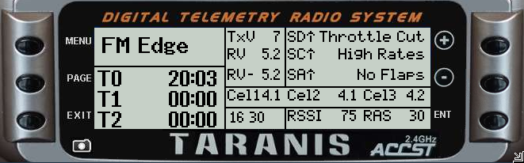

(located in `config/configs/norssi.lua`)

The telemetry screen is composed of a set of *widgets*.  Each widget
communicates a piece of information.  For example, there is a widget that tells
you the value of a timer, one that displays the RSSI graph, etc.  You can
customize which widgets you want and how they are laid out on the screen.

### Configuration File

There are *two* ways to manage configuration:

Edit `SCRIPTS/TELEMETRY/widget.lua`, search for `CONFIG START`, and start
hacking in new values.

*or*
  
Create (or copy) a new file in `config/configs`.  This file contains only
the configuration data and no code.  You can then combine the data and
code using the provided python script in config.  For example:
`python combine.py configs/funfly.lua`

The second method involves extra steps but can make config management easier.
It's up to you.

### Widget Layout (Placement)

Widget layout is via a flexible grid system.  This section explains what a
flexible grid is and how to use it. If you are familiar with the concept, feel
free to skip or skip this section.

We'll start with an analogy that is nearly identical, a spreadsheet.  Here is a
spreadsheet that contains our model name, a couple of switch states, a couple
timers, some voltages, and the RSSI graph:

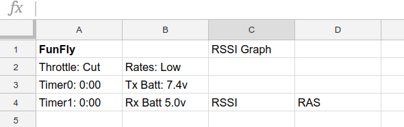

The first improvement is to make the title and graph extend to occupy multiple
cells:

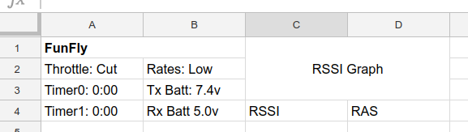

Next, we can resize rows and columns as needed to make better use of the space:

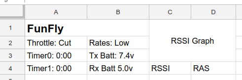

As a final touch, we add lines to visually group the data.

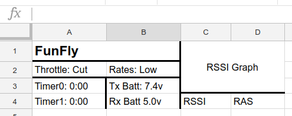

With the above in mind, we are ready to understand the layout system.  To start,
we provide a layout structure in the configuration file (e.g. `widget.lua`):

    layout = {
      -- stuff goes here
    }

Next we add a definition for rows and columns.  The numbers are pixel offsets.
The QX7 has a screen resolution of 128x64 so the maximum sensible column offset
is 127 and the maximum sensible row offset is 63.  The X9D has a resolution of
212x64.  Let's proceed with the X9D, trying to make something that looks like
the spreadsheet example.

    layout = {
      columns = {52, 105, 158, 211};
      rows = {20, 41, 52, 63};
    }

Note that the "0" row and columns are assumed and not put into the definition.
So by the above definition:

* Cell 0, 0 has a width of 52 pixels and a height of 20 pixels.  
* Cell 2, 2 has a width of (158 - 105) = 53 pixels and a height of
  (52 - 41) = 11 pixels.
* Cell 3, 2 has a width of (211 - 158) = 53 pixels and a height of
  (52 - 41) = 11 pixels.
      
...and so on.

There is also the concept of padding.  Padding puts a bit of space around
widgets, which usually looks nicer:

    layout = {
      columns = {52, 105, 158, 211};
      rows = {11, 24, 37, 50, 63};
      pad = 2;
    }

Let's start adding widgets:

    layout = {
      columns = {52, 105, 158, 211};
      rows = {11, 24, 37, 50, 63};
      pad = 2;
      widgets = {
        -- list them here
      }
    }

First, the model title:

    layout = {
      columns = {52, 105, 158, 211};
      rows = {11, 24, 37, 50, 63};
      pad = 2;
      widgets = {
        {
          column = 0;
          row = 0;
          width = 2;
          widget = LabelWidget({label = "FunFly"});
        }
      }
    }

Let's looks at some of the new details.  The values `column` and `row` tell
where to put the widget.  The `width` parameter is used here to specify the
column span of 2.  If the span was 1, you could omit `width`.  This is why there
is no `height`, the default height of 1 is fine.

Finally, the widget itself.  We are using a simple `LabelWidget`.  It's too
simple, really.  Better would be to have the current model name as reported by
OpenTX.  That is possible, but I'll defer the details until the "widgets"
section below.

To complete the example, let's add one more widget.  To fully reproduce the
spreadsheet, we would need to add more but this would expose details that I
feel are best explained in the Widgets section below.  The focus of this
section is understanding how rows, columns, widths, and heights work:

    layout = {
      columns = {52, 105, 158, 211};
      rows = {11, 24, 37, 50, 63};
      pad = 2;
      widgets = {
        {
          column = 0;
          row = 0;
          width = 2;
          widget = LabelWidget({label = "FunFly"});
        },
        {
          column = 2;
          row = 0;
          width = 2;
          height = 3;
          widget = RSSIHistogramWidget()
        }
      }
    }

## Widget Basics

A widget is a Lua object that knows how to fetch some data and draw to the LCD.
The basic way to create a widget is to call a function that creates and returns
one.

All Widgets take an options structure.  You can just pass `{}` if you don't
have any options to set:

    -- Defined with an option
    widget = RSSIHistogramWidget({greyscale = true})
    -- just take the default
    widget = RSSIHistogramWidget({})

If you want to add features to Widgets or create your own, refer to the comments
and documentation in `config/widget.lua`

## Widget Reference

### Current Date Widget

Displays the current date as YYYY-MM-DD

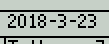

#### Usage Example:

    widgets = {
      {
        column = 0;
        row = 0;
        width = 2;
        widget = CurrentDateWidget({})
      },
    }

#### Options:

* `flags`: Flags are forwarded to `drawText()` and can make the text bold,
   at different sizes, etc.  See OpenTX docs for details.
* `separator`: Change the separator from '-' to some other character.

### Current Time Widget

Displays the current time in 24-hour format.

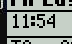

#### Usage Example:

    widgets = {
      {
        column = 0;
        row = 0;
        width = 2;
        widget = CurrentTimeWidget({})
      },
    }

#### Options:

* `flags`: Flags are forwarded to `drawText()` and can make the text bold,
   at different sizes, etc.  See OpenTX docs for details.
* `flash`: If true, flashes the ':' characters once a second.
* `show_seconds`: If true, includes seconds in the label.

### Label Widget

Draws a label that can be directly provided, or optionally provided via a
callback function.

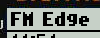

#### Usage Example:

    widgets = {
      {
        column = 0;
        row = 0;
        width = 2;
        widget = LabelWidget({
          init_func = function()
            return model.getInfo().name
          end;
          label_flags = BOLD;
        })
      },
    }

#### Options:

* `label`: Use a simple string label.  If `init_func` is set, this is ignored
* `init_func`: Call the given function and display it's returned value
* `label_flags`: Flags are forwarded to `drawText()` and can make the text
   bold, at different sizes, etc.  See OpenTX docs for details.

### Line Widget

Used to draw lines between other widgets for grouping.

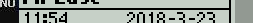

#### Usage Example:

    {
      column = 1;
      row = 1;
      height = 2;
      width = 0;
      pad = 0;
      widget = LineWidget({})
    },

#### Options:

* `pattern`: Settings for `drawLine()` pattern.  See OpenTX docs for details.
* `flags`: Settings for `drawLine()` flags.  See OpenTX docs for details.

### RSSI Histogram Widget

Draws a real time RSSI histogram.  Auto scales Y axis.  Uses log scale for
amounts so that rare readings still show up.

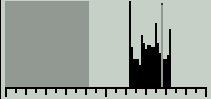

Needs a pixel width of at least 100 as-coded or it wont draw anything.

#### Usage Example:

    widgets = {
      {
        column = 2;
        row = 0;
        width = 2;
        height = 4;
        widget = RSSIHistogramWidget({greyscale = true})
      }
    }

#### Options:

* `greyscale`: If true, then the RSSI critical level is drawn as a greyscale
rectangle.  This won't work on the QX7, which has a monochrome display.

### Switch Widget

Shows the value of a switch along with a custom label.  Can also change style
(e.g. bold, inverse, flashing) depending on state.

The idea is both to remind the pilot what switches are relevant and to show if a
switch is in a non-default state.

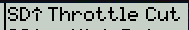

#### Usage Example:
  
Say you control rates via switch SC and want the default setting to be high

    {
      column = 1;
      row = 1;
      widget = SwitchWidget("sc", {
      labels = {"High", "Low", "Low"},
      flags = {0, INVERS, INVERS}
      })
    },

The settings above will show High is SC if forward, and Low otherwise.
Also, the Low labels will be displayed in an inverse font

#### Parameters

* `switch`: The name of the switch as defined by OpenTX.  Examples include `sa`, `sb`, `sc`.

#### Options:

* `flags`: Draw flags that correspong to each switch state.  e.g. `BOLD`,
`INVERS`
* `labels`: Labels that correspond to each switch state

### Timer Widget

Shows the value of a timer. 

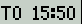

#### Usage Example:

    {
      column = 0;
      row = 2;
      widget = TimerWidget(0, {})
    },

#### Parameters

* `timer_number`: Which timer to display.  Zero-based.

#### Options:

* `timer_flags`: Display flags for timer.  e.g. `BOLD`, `INVERS`
* `label_flags`: Display flags for `T0`, `T1`, or `T2` label

### Value Widget

Draws a labeled value.  By default, calls `getValue()` for the value.  See the
OpenTX docs for available `getValue()` strings.

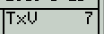

#### Usage Example:

    {
      column = 0;
      row = 1;
      widget = ValueWidget("RS", {func=getRSSI})
    },
    {
      column = 1;
      row = 1;
      widget = ValueWidget("tx-voltage", {label="TxV", decimals=1})
    },

#### Parameters

* `parm`: The parameter to pass to `getValue()`.  Also used as the label by
  default.  Note that `func` and `label` options below modify this behavior
  somewhat.

#### Options:

* `label`: The label to put in front of the value.  If omitted, uses `parm` for
  the label.
* `label_flags`: Label draw flags (e.g. `BOLD`).  See OpenTX docs for
   `drawText()` for more information.
* `value_flags`: Value draw flags (e.g. `BOLD`).  See OpenTX docs for
   `drawText()` for more information.
* `func`: If set, calls this function for the value instead of `getValue()`
* `decimals`: If set, rounds the output value to the given number of decimals.
  e.g.  `5.2345` becomes `5.23` if `decimals = 2`

### Per Radio and Per Model Customization

To support multiple radios and models, you have two options:

#### Static Config

* Create a separate config for each model you have.  These are best
  placed in `config/configs`
* Use `configs/combine.py` to make a lua script for each model.  Example usage is
  `python combine.py configs/edg540.lua`
* In the telemetry page for each model, choose the corresponding lua file.

This approach has downsides if you have many models - especially since model
setups tend to be similar.  Below you can learn to do it with one config.

#### Dynamic Config - Per model widgets

There are two additional widget fields: *not_models* and *only_models* which can
be used as filters.  Each takes a list of model names.

For example, say you have the following layout:

    layout = {
      columns = {52, 105, 158, 211};
      rows = {11, 24, 37, 50, 63};
      pad = 2;
      widgets = {
      }
        -- stuff...
        {
          column = 1;
          row = 2;
          only_models = {"Mustang", "Beaver"};
          widget = SwitchWidget("sa", {
          labels = {"NoFlp", "Flap1", "Flap2"},
          flags = {0, INVERS, INVERS}
          })
        },
        {
          column = 1;
          row = 2;
          not_models = {"Mustang", "Beaver"};
          widget = ValueWidget("tx-voltage", {label="TxV", decimals=1})
        },
        -- more stuff...
    }

In the example above, we show a `Flaps` status for the `Mustang` and `Beaver`
models while showing `TxV` for everyone else.  The idea is that other models we
own don't have flaps and it would be better to use the space for something
else.

#### Dynamic Config - Per radio (or model) layouts

The function `chooseSetup()` is called to return a layout config.  This can
simply return a set config or can optionally contain any sort of logic you
want.  Here is a simple script that returns a different config depending on
radio model:

    local QX7_Layout = {
      -- stuff
    }
  
    local X9D_Layout = {
      -- stuff
    }
  
    local function chooseSetup()
      local _, radio = getVersion()
    
    
      if string.find(radio, "x9D") ~= nil then
        return X9D_Layout
      end
  
      return QX7_Layout
    end

### Resetting

You may want to reset the telemetry graph when resetting a flight, or when a
switch is toggled.  This can be done with a global variable.

To start, choose a global variable index to use.  Then set this in your config
to that index:

    resetGlobalVarIndex = 5  -- choose GV6

Now, any time you want to reset the telemetry, write a non-zero value to that
variable.  A basic setup is to create a special function that changes the
variable.
